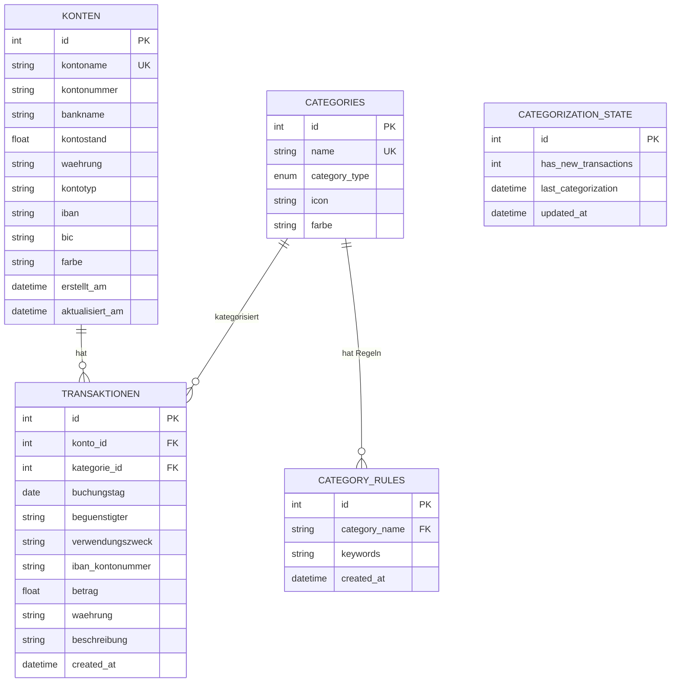

# FINLY – Persönlicher Ausgabenmanager 📊

## Projektübersicht

**FINLY** ist ein persönlicher Ausgabenmanager zur Analyse, Verwaltung und Prognose finanzieller Daten.
Das Projekt wurde von der **Gruppe a3–5** im Rahmen des Moduls „Programmieren für KI" im Wintersemester 2025/2026 an der Fachhochschule Südwestfalen entwickelt.

Ziel von FINLY ist es, einen übersichtlichen Einblick in die eigenen Finanzen zu geben. Es bietet die Möglichkeit, diese zu verwalten, zu erfassen und zu visualisieren.

---

## Features (Überblick)

| Feature | Beschreibung |
|---------|--------------|
| **Übersicht** | Dashboard mit den wichtigsten Informationen übersichtlich dargestellt |
| **Transaktionen** | Verwaltung aller Einnahmen und Ausgaben mit Such- und Filterfunktionen |
| **Kategorien** | Automatische und manuelle Kategorisierung von Transaktionen |
| **Konten** | Verwaltung mehrerer Bankkonten mit Kontostandsberechnung |
| **Zinsprognose** | Berechnung von Sparplänen und Zinseszins-Prognosen |
| **Finanzbuddy** | KI-basierter Chatbot für Finanzfragen (powered by Google Gemini) |

---

## Funktionalitäten im Detail

### Dashboard

Das Dashboard bietet eine zentrale Übersicht über die finanzielle Situation.
Neben wesentlichen KPIs werden die monatlichen Ausgaben nach Kategorien visualisiert, unter anderem mithilfe eines **Sankey-Diagramms**. Zusätzlich werden die Top-Ausgabekategorien sowie die Entwicklung der Ausgaben über die letzten Monate dargestellt.

**Umgesetzt von:** *Noch füllen*

---

### Transaktionen

*Noch füllen*

**Umgesetzt von:** *Noch füllen*

---

### Kategorien

Das Categories-Modul ermöglicht die automatische Zuordnung von Transaktionen zu Kategorien mittels regelbasierter Kategorisierung. Das System ist selbstlernend und verbessert sich durch Analyse bereits kategorisierter Transaktionen kontinuierlich.

**Komponenten:**
- `categories.py` – Kategorieverwaltung (CRUD-Operationen, Standard-Kategorien)
- `categorizer_rules.py` – Regelbasierte Kategorisierungs-Engine mit Keyword-Matching
- `auto_categorizer_service.py` – Iterativer Lernzyklus für automatische Kategorisierung
- `rules.py` – Default-Kategorisierungsregeln

**Features:**
- Selbstlernender Algorithmus mit Stopword-Filter und Eindeutigkeitsprüfung
- Automatische Trigger bei Backend-Start, CSV-Import und Transaktions-Schwellwert
- Caching-Mechanismus für Performance-Optimierung

**Umgesetzt von:** *Noch füllen*

---

### Konten

*Noch füllen*

**Umgesetzt von:** *Noch füllen*

---

### Zinsprognose

*Noch füllen*

**Umgesetzt von:** *Noch füllen*

---

### Finanzbuddy

Das Chatbot-Modul implementiert einen KI-gestützten Finanzassistenten, der natürlichsprachige Anfragen zu Finanzdaten beantwortet. Es nutzt die **Google Gemini API** mit automatischem Function Calling.

**Komponenten:**
- `gemini_client.py` – Gemini API Client (Modell: gemini-2.5-flash)
- `tools.py` – 8 Database-Tools für Function Calling

**Verfügbare Tools:**
| Tool | Funktion |
|------|----------|
| `get_transactions()` | Transaktionsabfrage mit Filtern |
| `get_spending_by_category()` | Ausgaben nach Kategorie aggregiert |
| `get_monthly_summary()` | Monatliche Einnahmen/Ausgaben/Bilanz |
| `get_account_overview()` | Kontoübersicht mit Details |
| `get_income_vs_expenses()` | Einnahmen vs. Ausgaben Vergleich |
| `get_categories()` | Liste aller Kategorien |
| `get_database_statistics()` | Datenbank-Statistiken |
| `get_transaction_stats()` | Summen, Durchschnitte, Min/Max |

**Umgesetzt von:** *Noch füllen*

---

### Suche

*Noch füllen*

**Umgesetzt von:** *Noch füllen*


---

### API

Das API-Modul stellt die RESTful-Schnittstelle der Anwendung bereit. Es basiert auf FastAPI und bietet automatische Dokumentation, Datenvalidierung mit Pydantic und asynchrone Request-Verarbeitung.

**Hauptendpunkte:**
- `/transactions` – CRUD für Transaktionen
- `/konten` – CRUD für Konten
- `/categories` – Kategorieverwaltung
- `/api/chatbot` – Chatbot-Kommunikation
- `/api/zinsrechner` – Zinsberechnungen
- `/import/transactions` – CSV-Import

**Umgesetzt von:** *Noch füllen*

---

### Datenbank

Das Datenbank-Modul verwaltet die Datenpersistenz mit SQLAlchemy ORM und SQLite. Es definiert alle Datenmodelle und bietet spezialisierte Services für Kontoverwaltung, CSV-Import und Transaktionssuche.

**Modelle:**
- `Konto` – Bankkonten mit Kontostand
- `Transaktion` – Einnahmen/Ausgaben
- `Category` – Kategorien mit Icons und Farben
- `CategoryRules` – Automatische Kategorisierungsregeln
- `CategorizationState` – Status der Auto-Kategorisierung

**Umgesetzt von:** *Noch füllen*

---

## Aufbau des Projektes

### Projektstruktur

```
FINLY/
├── start.bat / start.sh     # Ein-Klick-Startskripte
├── requirements.txt         # Python-Abhängigkeiten
├── .env                     # API-Keys (optional)
├── data/
│   └── expenses.db          # SQLite-Datenbank
├── src/
│   ├── api/                 # FastAPI REST-Backend
│   ├── database/            # Datenbankmodelle & Services
│   ├── categories/          # Kategorisierungs-Engine
│   └── chatbot/             # Gemini AI Integration
├── static/
│   ├── css/                 # Stylesheets
│   └── js/                  # Frontend JavaScript
└── templates/               # HTML-Seiten
```

### Datenbank-Schema



### Module im Detail

#### API-Modul (`src/api/`)

FastAPI-basierte REST-Schnittstelle mit Pydantic-Validierung.

| Datei | Funktion |
|-------|----------|
| `main.py` | App-Bootstrap, Router-Registrierung, Lifespan-Management |
| `schemas.py` | Pydantic-Schemas für Request/Response |
| `transactions_routes.py` | Transaktions- und Konto-Endpunkte |
| `category_routes.py` | Kategorie-Endpunkte |
| `chatbot_routes.py` | Chatbot-Endpunkte |
| `zinsrechner_routes.py` | Zinsrechner-Endpunkte |

#### Datenbank-Modul (`src/database/`)

SQLAlchemy ORM mit SQLite.

| Datei | Funktion |
|-------|----------|
| `models.py` | ORM-Modelle (Konto, Transaktion, Category, etc.) |
| `connection.py` | Datenbankverbindung und Session-Factory |
| `konto_manager.py` | CRUD-Operationen für Konten |
| `csv_importer.py` | CSV-Import mit Auto-Delimiter-Erkennung |
| `search.py` | Erweiterte Transaktionssuche mit Filtern |

#### Categories-Modul (`src/categories/`) – Ausführliche Dokumentation

**Dateistruktur:**

```
src/categories/
├── __init__.py                    # Modul-Initialisierung und Exports
├── categories.py                  # Kategorieverwaltung und -operationen
├── categorizer_rules.py           # Regelbasierte Kategorisierungs-Engine
├── auto_categorizer_service.py    # Iterativer Kategorisierungs- und Lernservice
└── rules.py                       # Standard-Kategorisierungsregeln
```

**1. `categories.py`** - Kategorieverwaltung

- **Standard-Kategorien**: Automatisches Laden von vordefinierten Kategorien (Lebensmittel, Miete, Gehalt, etc.) bei erster Nutzung
- **CRUD-Operationen**:
  - `add_category()`: Erstellt neue Kategorien mit Validierung
  - `remove_category()`: Löscht Kategorien inklusive zugehöriger Regeln
  - `get_categories()`: Ruft alle verfügbaren Kategorien ab
  - `assign_category_to_transaction()`: Weist Transaktionen Kategorien zu
- **Sonstiges**:
  - Icon- und Farbunterstützung für UI-Integration
  - Konsistente Foreign-Key-Behandlung beim Löschen

**2. `categorizer_rules.py`** - Kategorisierungs-Engine

- **Hauptklasse `Categorizer`**: Regelbasierte Kategorisierung
- **Kernfunktionen**:
  - `suggest_category()`: Schlägt Kategorie basierend auf Keywords vor
  - `categorize_all()`: Kategorisiert alle oder nur unkategorisierte Transaktionen
  - `learn_from_categorized_transactions()`: Lernt neue Keywords aus bereits kategorisierten Daten
  - `add_keyword_to_rule()` / `remove_keyword_from_rule()`: Dynamische Regelverwaltung
- **Intelligente Features**:
  - Keyword-Matching über mehrere Transaktionsfelder (Begünstigter, Verwendungszweck, IBAN, Beschreibung)
  - Stopword-Filter zur Vermeidung von generischen Keywords
  - Eindeutigkeitsprüfung: Keywords werden nur gelernt, wenn sie eindeutig einer Kategorie zugeordnet sind
  - Caching-Mechanismus mit 5-Minuten-Zeitfenster für Performance-Optimierung

**3. `auto_categorizer_service.py`** - Automatisierter Lernservice

- **Hauptklasse `AutoCategorizerService`**: Orchestriert iterative Kategorisierungs- und Lernzyklen
- **Iterativer Lernzyklus** (`run_full_categorization_cycle()`):
  1. Kategorisiert alle unkategorisierten Transaktionen
  2. Zählt aktuelle Keywords
  3. Lernt neue Keywords aus kategorisierten Transaktionen
  4. Prüft ob neue Keywords hinzugefügt wurden
  5. Wiederholt Prozess bis keine neuen Keywords mehr gefunden werden
- **Automatische Trigger**:
  - **Backend-Start**: Prüft beim Starten der Anwendung automatisch auf neue Transaktionen
  - **CSV-Import**: Startet nach jedem erfolgreichen CSV-Import automatisch einen Lernzyklus
  - **Transaktions-Schwellwert**: Löst automatisch einen Lernzyklus aus, sobald 5 neue Transaktionen hinzugefügt wurden
- **State-Management**:
  - `increment_transaction_counter()`: Zählt neue Transaktionen
  - `should_trigger_categorization()`: Prüft ob Auto-Kategorisierung ausgelöst werden soll
  - `get_categorization_state()`: Gibt aktuellen Status zurück
- **Singleton-Pattern**: Globale Service-Instanz über `get_auto_categorizer_service()`

**4. `rules.py`** - Regelkonfiguration

- Enthält `DEFAULT_CATEGORIZATION_RULES` mit vordefinierten Keywords für Standardkategorien
- Wird beim ersten Start automatisch in die Datenbank geladen

**Algorithmus-Logik:**

1. **Keyword-Extraktion**: Transaktionsfelder werden zu einem Suchtext kombiniert und in Kleinbuchstaben konvertiert
2. **Pattern-Matching**: Jede Regel wird gegen den Suchtext geprüft
3. **Adaptive Regelgenerierung**: Häufig vorkommende, eindeutige Keywords werden automatisch als neue Regeln hinzugefügt
4. **Feedback-Loop**: System verbessert sich durch jede kategorisierte Transaktion

**Besondere Algorithmus-Features:**

- **Stopword-Filter**: Entfernt bedeutungslose Wörter wie "und", "für", "mit"
- **Mindestlänge**: Keywords müssen mindestens 3 Zeichen haben
- **Eindeutigkeitsprüfung**: Keywords, die in mehreren Kategorien vorkommen, werden ignoriert
- **Häufigkeitsfilter**: Nur Keywords mit Mindestanzahl an Vorkommen (default: 3) werden gelernt

---

#### Chatbot-Modul (`src/chatbot/`) – Ausführliche Dokumentation

**Dateistruktur:**

```
src/chatbot/
├── __init__.py           # Modul-Exports
├── gemini_client.py      # Gemini API Client mit Function Calling
└── tools.py              # Database-Tools für Function Calling
```

**1. `gemini_client.py`** - Gemini API Integration

- **Hauptklasse `GeminiChatbot`**: Verwaltet Kommunikation mit Gemini API
- **Initialisierung**:
  - Benötigt API-Key und SQLAlchemy Session
  - Verwendet Modell `gemini-2.5-flash`
  - Hält Chat-Historie für Kontext
- **System Instruction**: Definiert Verhaltensregeln für den Assistenten:
  - Immer Tools verwenden, niemals raten
  - Kein manuelles Rechnen - nur Tool-basierte Berechnungen
  - Präzise Antworten ohne Erfindung von Daten
  - Unterstützung für komplexe Multi-Filter-Anfragen
- **Methoden**:
  - `send_message()`: Sendet Benutzeranfrage und erhält KI-Antwort mit automatischem Function Calling
  - `reset_chat()`: Löscht Chat-Historie

**2. `tools.py`** - Function Calling Tools

- **Session-Management**:
  - `set_db_session()`: Setzt globale Datenbank-Session
  - `get_db_session()`: Gibt aktuelle Session zurück
- **Implementierte Tools** (8 Funktionen):

| Tool | Beschreibung |
|------|--------------|
| `get_transactions()` | Transaktionsabfrage mit Filter: Datumsbereich, Kategorie, Typ. Limit-Parameter (default: 100), Sortierung nach Buchungstag |
| `get_spending_by_category()` | Aggregiert Ausgaben pro Kategorie mit optionalem Datumsfilter, sortiert nach Gesamtausgaben |
| `get_monthly_summary()` | Einnahmen und Ausgaben pro Monat, berechnet Bilanz (Einnahmen - Ausgaben) |
| `get_account_overview()` | Listet alle Konten mit Kontostände, Kontotypen und Banknamen |
| `get_income_vs_expenses()` | Vergleich für definierten Zeitraum, berechnet Gesamtbilanz |
| `get_categories()` | Gibt alle verfügbaren Kategorien mit Typ (Einnahme/Ausgabe) zurück |
| `get_database_statistics()` | Anzahl Transaktionen, Konten, Kategorien und Zeitraum der Daten |
| `get_transaction_stats()` | Berechnet Summe, Anzahl, Durchschnitt, Min, Max mit allen Filteroptionen |

**Function Calling Workflow:**

1. User stellt Frage
2. Gemini analysiert Anfrage und entscheidet welche Tools benötigt werden
3. API ruft automatisch relevante Tools auf
4. Tools führen Datenbankabfragen durch
5. Ergebnisse werden zurück an Gemini gegeben
6. Gemini generiert natürlichsprachige Antwort basierend auf Daten

**Automatisches Function Calling:**

- Gemini entscheidet selbstständig welche Funktionen aufgerufen werden
- Mehrere Function Calls pro Anfrage möglich
- Ergebnisse werden automatisch in Kontext integriert

**Fehlerbehandlung:**

- Try-Catch für API-Fehler
- Benutzerfreundliche Fehlermeldungen
- Robuste None-Checks bei Datenbankabfragen

---

## Hinweise zur Ausführung

### 🚀 Schnellstart (Windows)

1. **Doppelklicke auf `start.bat`** im Hauptordner
2. Das Skript prüft alles, startet den Server und öffnet deinen Browser automatisch
3. Fertig! 🎉

### 🍎 Schnellstart (Mac/Linux)

1. **Terminal öffnen** und zum Projektordner navigieren
2. `./start.sh` ausführen
3. Browser öffnet sich automatisch

### 🛠️ Manuelle Installation

```powershell
# 1. Umgebung erstellen & aktivieren
python -m venv venv
.\venv\Scripts\activate  # Windows
source venv/bin/activate # Mac/Linux

# 2. Abhängigkeiten installieren
pip install -r requirements.txt

# 3. Optional: API-Key konfigurieren (.env Datei)
GEMINI_API_KEY=dein_key_hier

# 4. Server starten
python -m uvicorn src.api.main:app --reload
```

Browser öffnen: http://127.0.0.1:8000

---

## Trennung der Verantwortlichkeit

| Name | Verantwortungsbereich |
|------|----------------------|
| **Arienne Bertram** | UI/UX Programmierung |
| **Emil Horstmann** | *Noch füllen* |
| **Paul-Gerhart Siegel** | *Noch füllen* |
| **Leonardo Fabian Ferreira Pfeiffer** | *Noch füllen* |
| **Sinan Felix Atay** | *Noch füllen* |

---

## Verwendete Technologien

### Backend
| Technologie | Verwendung |
|-------------|------------|
| **Python 3.x** | Programmiersprache |
| **FastAPI** | REST-API Framework |
| **SQLAlchemy** | ORM für Datenbankzugriff |
| **SQLite** | Datenbank |
| **Pydantic** | Datenvalidierung |
| **Uvicorn** | ASGI-Server |

### Frontend
| Technologie | Verwendung |
|-------------|------------|
| **HTML5/CSS3** | Struktur und Styling |
| **JavaScript** | Interaktivität |
| **Plotly.js** | Interaktive Charts (Sankey, etc.) |

### KI-Integration
| Technologie | Verwendung |
|-------------|------------|
| **Google Gemini API** | KI-Chatbot (Finanzbuddy) |
| **Gemini 2.5 Flash** | Verwendetes Modell |
| **Function Calling** | Automatische Datenbankabfragen durch KI |
