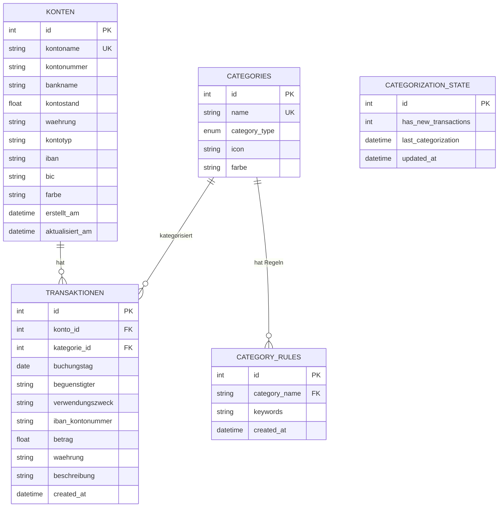

# FINLY – Persönlicher Ausgabenmanager 📊

## Inhaltsverzeichnis

- [FINLY – Persönlicher Ausgabenmanager 📊](#finly--persönlicher-ausgabenmanager-)
  - [Inhaltsverzeichnis](#inhaltsverzeichnis)
  - [Projektübersicht](#projektübersicht)
  - [Features (Überblick)](#features-überblick)
  - [Funktionalitäten im Detail](#funktionalitäten-im-detail)
    - [Dashboard](#dashboard)
    - [Transaktionen](#transaktionen)
    - [Kategorien](#kategorien)
    - [Konten](#konten)
    - [Zinsprognose](#zinsprognose)
    - [Finanzbuddy](#finanzbuddy)
    - [Suche](#suche)
    - [Importer](#importer)
    - [API](#api)
    - [Datenbank](#datenbank)
  - [Hinweise zur Ausführung](#hinweise-zur-ausführung)
    - [🚀 Schnellstart (Windows)](#-schnellstart-windows)
    - [🍎 Schnellstart (Mac/Linux)](#-schnellstart-maclinux)
    - [🛠️ Manuelle Installation](#️-manuelle-installation)
  - [Detailierter Aufbau des Projektes](#detailierter-aufbau-des-projektes)
    - [Projektstruktur](#projektstruktur)
    - [Module im Detail](#module-im-detail)
      - [API-Modul (`src/api/`)](#api-modul-srcapi)
      - [Datenbank-Modul (`src/database/`)](#datenbank-modul-srcdatabase)
      - [Categories-Modul (`src/categories/`)](#categories-modul-srccategories)
      - [Chatbot-Modul (`src/chatbot/`)](#chatbot-modul-srcchatbot)
      - [Frontend-Modul (`static/js/`)](#frontend-modul-staticjs)
      - [Zinsrechner-Modul (`src/api/zinsrechner_routes.py`)](#zinsrechner-modul-srcapizinsrechner_routespy)
      - [CSV-Importer (`src/database/csv_importer.py`)](#csv-importer-srcdatabasecsv_importerpy)
      - [Suche-Modul (`src/database/search.py`)](#suche-modul-srcdatabasesearchpy)
  - [Trennung der Verantwortlichkeit](#trennung-der-verantwortlichkeit)
  - [Verwendete Technologien](#verwendete-technologien)
    - [Backend](#backend)
    - [Frontend](#frontend)

---

## Projektübersicht

**FINLY** ist ein persönlicher Ausgabenmanager zur Analyse, Verwaltung und Prognose finanzieller Daten.
Das Projekt wurde von der **Gruppe a3–5** im Rahmen des Moduls „Programmieren für KI" im Wintersemester 2025/2026 an der Fachhochschule Südwestfalen entwickelt.

Ziel von FINLY ist es, einen übersichtlichen Einblick in die eigenen Finanzen zu geben. Es bietet die Möglichkeit, diese zu verwalten, zu erfassen und zu visualisieren.

---

## Features (Überblick)

| Feature           | Beschreibung                                                           |
| ----------------- | ---------------------------------------------------------------------- |
| **Übersicht**     | Dashboard mit den wichtigsten Informationen übersichtlich dargestellt  |
| **Transaktionen** | Verwaltung aller Einnahmen und Ausgaben mit Such- und Filterfunktionen |
| **Kategorien**    | Automatische und manuelle Kategorisierung von Transaktionen            |
| **Konten**        | Verwaltung mehrerer Bankkonten mit Kontostandsberechnung               |
| **Zinsprognose**  | Berechnung von Sparplänen und Zinseszins-Prognosen                     |
| **Finanzbuddy**   | KI-basierter Chatbot für Finanzfragen (powered by Google Gemini)       |
| **Suche**         | Erweiterte Suchfunktionen mit Filtern und Datumsbereichen              |
| **Importer**      | CSV-Import für Transaktionsdaten verschiedener Banken                  |
| **API**           | RESTful-Schnittstelle für Frontend-Backend-Kommunikation               |
| **Datenbank**     | SQLite-Datenpersistenz mit SQLAlchemy ORM                              |

---

## Funktionalitäten im Detail

### Front-End

_Noch füllen_

**Umgesetzt von:** _Arienne Bertram_

---

### Transaktionen

Das Transaktionsmodul verwaltet alle Einnahmen und Ausgaben mit umfangreichen Such- und Filterfunktionen. Benutzer können Transaktionen erstellen, bearbeiten, löschen und nach verschiedenen Kriterien filtern (Datum, Kategorie, Betrag, Begünstigter).

**Umgesetzt von:** _Emil Horstmann_

---

### Kategorien

Das Categories-Modul ermöglicht die automatische Zuordnung von Transaktionen zu Kategorien mittels regelbasierter Kategorisierung. Das System ist selbstlernend und verbessert sich durch Analyse bereits kategorisierter Transaktionen kontinuierlich.

**Komponenten:**

- `categories.py` – Kategorieverwaltung (CRUD-Operationen, Standard-Kategorien)
- `categorizer_rules.py` – Regelbasierte Kategorisierungs-Engine mit Keyword-Matching
- `auto_categorizer_service.py` – Iterativer Lernzyklus für automatische Kategorisierung
- `rules.py` – Standard-Kategorisierungsregeln

**Features:**

- Selbstlernender Algorithmus mit Stopword-Filter und Eindeutigkeitsprüfung
- Automatische Trigger bei Backend-Start, CSV-Import und Transaktions-Schwellwert
- Caching-Mechanismus für Performance-Optimierung

**Umgesetzt von:** _Leonardo Ferreira Pfeiffer_

---

### Konten

_Noch füllen_

**Umgesetzt von:** _Noch füllen_

---

### Zinsprognose

**Funktionsumfang**

- Darstellung der Kapitalentwicklung über einen frei wählbaren Zeitraum
- Berücksichtigung von Startkapital, Zinssatz, regelmäßigen Einzahlungen und Zinseszins
- Visualisierung als Liniendiagramm

**Komponenten:**

- `zinsrechner.html` - Buttons, Schieberegler, Texteingabe
- `zinsrechner.js` - Funktionalitäten(Chart-Initialisierung, Verkabelung Input Felder, Zinsberechnung, Vorschau Option, Operationen: Berechnen, Aktualisieren, Löschen, Zurücksetzen)
- `vergleich_X.db` - Datenbank wird für die Berechneten Werte erstellt. Jeweils eine pro Berechnung (max. 3)
- `zinsrechner_routes.py` - Backend API - Berechnungen speichern und laden aus Vergleichsdatenbanken oder Kontendatenbank

Frontend → Backend:
Kommunikation über REST-API (FastAPI)
Aktionen: Berechnung speichern, Prognosen laden, Prognosen löschen, Kontodaten abrufen

Backend → Datenbanken:
expenses.db: Zugriff auf Kontodaten der gesamten App
vergleich_X.db: Verwaltung der Zinsprognosen

**Umgesetzt von:** Sinan Felix Atay

---

### Finanzbuddy

Das Chatbot-Modul implementiert einen KI-gestützten Finanzassistenten, der natürlichsprachige Anfragen zu Finanzdaten beantwortet. Es nutzt die **Google Gemini API** mit automatischem Function Calling.

**Komponenten:**

- `gemini_client.py` – Gemini API Client (Modell: gemini-2.5-flash)
- `tools.py` – Database-Tools für Function Calling

**Verfügbare Tools:**
| Tool | Funktion |
|------|----------|
| `get_transactions()` | Transaktionsabfrage mit Filtern |
| `get_spending_by_category()` | Ausgaben nach Kategorie aggregiert |
| `get_monthly_summary()` | Monatliche Einnahmen/Ausgaben/Bilanz |
| `get_account_overview()` | Kontoübersicht mit Details |
| `get_income_vs_expenses()` | Einnahmen vs. Ausgaben Vergleich |
| `get_categories()` | Liste aller Kategorien |
| `get_database_statistics()` | Datenbank-Statistiken |
| `get_transaction_stats()` | Summen, Durchschnitte, Min/Max |

**Umgesetzt von:** _Leonardo Ferreira Pfeiffer_

---

### Suche

_Noch füllen_

**Umgesetzt von:** _Noch füllen_

---

### Importer

_Noch füllen_

**Umgesetzt von:** _Noch füllen_

---

### API

Das API-Modul stellt die RESTful-Schnittstelle der Anwendung bereit. Es basiert auf FastAPI und bietet automatische Dokumentation, Datenvalidierung mit Pydantic und asynchrone Request-Verarbeitung.

**Hauptendpunkte:**

- `/transactions` – CRUD für Transaktionen
- `/konten` – CRUD für Konten
- `/categories` – Kategorieverwaltung
- `/api/chatbot` – Chatbot-Kommunikation
- `/api/zinsrechner` – Zinsberechnungen
- `/import/transactions` – CSV-Import

**Umgesetzt von:** _Emil Horstmann_

---

### Datenbank

Das Datenbank-Modul verwaltet die Datenpersistenz mit SQLAlchemy ORM und SQLite. Es definiert alle Datenmodelle und bietet spezialisierte Services für Kontoverwaltung, CSV-Import und Transaktionssuche.

**Modelle:**

- `Konto` – Bankkonten mit Kontostand
- `Transaktion` – Einnahmen/Ausgaben
- `Category` – Kategorien mit Icons und Farben
- `CategoryRules` – Automatische Kategorisierungsregeln
- `CategorizationState` – Status der Auto-Kategorisierung

**Umgesetzt von:** _Emil Horstmann_

---

## Hinweise zur Ausführung

### 🚀 Schnellstart (Windows)

1. **Doppelklicke auf `start.bat`** im Hauptordner
2. Das Skript prüft alles, startet den Server und öffnet deinen Browser automatisch
3. Fertig! 🎉

### 🍎 Schnellstart (Mac/Linux)

1. **Terminal öffnen** und zum Projektordner navigieren
2. `./start.sh` ausführen
3. Browser öffnet sich automatisch

### 🛠️ Manuelle Installation

```powershell
# 1. Umgebung erstellen & aktivieren
python -m venv venv
.\venv\Scripts\activate  # Windows
source venv/bin/activate # Mac/Linux

# 2. Abhängigkeiten installieren
pip install -r requirements.txt

# 3. Optional: API-Key konfigurieren (.env Datei)
GEMINI_API_KEY=dein_key_hier

# 4. Server starten
python -m uvicorn src.api.main:app --reload
```

Browser öffnen: http://127.0.0.1:8000

---

## Detailierter Aufbau des Projektes

### Projektstruktur

```
FINLY/
├── start.bat / start.sh     # Ein-Klick-Startskripte
├── requirements.txt         # Python-Abhängigkeiten
├── .env                     # API-Keys (optional)
├── data/
│   └── expenses.db          # SQLite-Datenbank
├── src/
│   ├── api/                 # FastAPI REST-Backend
│   ├── database/            # Datenbankmodelle & Services
│   ├── categories/          # Kategorisierungs-Engine
│   └── chatbot/             # Gemini AI Integration
├── static/
│   ├── css/                 # Stylesheets
│   └── js/                  # Frontend JavaScript
└── templates/               # HTML-Seiten
```
---

### Module/Funktionen im Detail

#### API-Modul (`src/api/`)

FastAPI-basierte REST-Schnittstelle mit Pydantic-Validierung. Das Modul stellt alle Backend-Endpunkte bereit und verarbeitet HTTP-Requests vom Frontend. Es verwendet asynchrone Request-Verarbeitung und bietet automatische OpenAPI-Dokumentation unter `/docs`.

| Datei                           | Funktion                                                 |
| ------------------------------- | -------------------------------------------------------- |
| `main.py`                       | App-Bootstrap, Router-Registrierung, Lifespan-Management |
| `schemas.py`                    | Pydantic-Schemas für Request/Response                    |
| `transactions_routes.py`        | Transaktions- und Konto-Endpunkte                        |
| `category_routes.py`            | Kategorie-Endpunkte                                      |
| `chatbot_routes.py`             | Chatbot-Endpunkte                                        |
| `zinsrechner_routes.py`         | Zinsrechner-Endpunkte                                    |
| `dependencies.py`               | Dependency Injection für Datenbank-Sessions              |
| `helpers.py`                    | Hilfsfunktionen für API-Operationen                      |
| `settings_routes.py`            | Einstellungs-Endpunkte                                   |
| `auto_categorization_routes.py` | Endpunkte für automatische Kategorisierung               |

**Hauptendpunkte:**
- `GET/POST/PUT/DELETE /transactions` – CRUD für Transaktionen
- `GET/POST/PUT/DELETE /konten` – CRUD für Konten
- `GET/POST/DELETE /categories` – Kategorieverwaltung
- `POST /api/chatbot` – Chatbot-Anfragen an Gemini
- `POST /api/zinsrechner` – Zinsberechnungen speichern/laden
- `POST /import/transactions` – CSV-Import

---

#### Datenbank-Modul (`src/database/`)

SQLAlchemy ORM mit SQLite. Das Modul verwaltet die komplette Datenpersistenz der Anwendung. Es definiert alle Datenmodelle, stellt die Datenbankverbindung her und bietet spezialisierte Services für verschiedene Domänen wie Kontoverwaltung und Transaktionssuche.

| Datei              | Funktion                                         |
| ------------------ | ------------------------------------------------ |
| `models.py`        | ORM-Modelle (Konto, Transaktion, Category, etc.) |
| `connection.py`    | Datenbankverbindung und Session-Factory          |
| `konto_manager.py` | CRUD-Operationen für Konten                      |
| `csv_importer.py`  | CSV-Import mit Auto-Delimiter-Erkennung          |
| `search.py`        | Erweiterte Transaktionssuche mit Filtern         |

**Kernfunktionen:**
- **Session-Management**: Automatische Erstellung und Verwaltung von Datenbank-Sessions
- **ORM-Mapping**: Python-Objekte werden automatisch in Datenbanktabellen übersetzt
- **Migrations-frei**: SQLite-Datenbank wird bei Bedarf automatisch erstellt
- **Beziehungen**: Foreign-Key-Beziehungen zwischen Konten, Transaktionen und Kategorien

**Datenbank-Schema:**


---

#### Categories-Modul (`src/categories/`)

**Dateistruktur:**

```
src/categories/
├── __init__.py                    # Modul-Initialisierung und Exports
├── categories.py                  # Kategorieverwaltung und -operationen
├── categorizer_rules.py           # Regelbasierte Kategorisierungs-Engine
├── auto_categorizer_service.py    # Iterativer Kategorisierungs- und Lernservice
└── rules.py                       # Standard-Kategorisierungsregeln
```

**`categories.py`** - Kategorieverwaltung

- **Standard-Kategorien**: Automatisches Laden von vordefinierten Kategorien (Lebensmittel, Miete, Gehalt, etc.) bei erster Nutzung
- **CRUD-Operationen**:
  - `add_category()`: Erstellt neue Kategorien mit Validierung
  - `remove_category()`: Löscht Kategorien inklusive zugehöriger Regeln
  - `get_categories()`: Ruft alle verfügbaren Kategorien ab
  - `assign_category_to_transaction()`: Weist Transaktionen Kategorien zu

**`categorizer_rules.py`** - Kategorisierungs-Engine

- **Hauptklasse `Categorizer`**: Regelbasierte Kategorisierung

- **Kernfunktionen**:
  - `suggest_category()`: Schlägt Kategorie basierend auf Keywords vor
  - `categorize_all()`: Kategorisiert alle oder nur unkategorisierte Transaktionen
  - `learn_from_categorized_transactions()`: Lernt neue Keywords aus bereits kategorisierten Daten
  - `add_keyword_to_rule()` / `remove_keyword_from_rule()`: Dynamische Regelverwaltung
- **Features**:
  - Keyword-Matching über mehrere Transaktionsfelder
  - Filter zur Vermeidung von generischen Keywords
  - Eindeutigkeitsprüfung: Keywords werden nur gelernt, wenn sie eindeutig einer Kategorie zugeordnet sind
  - Caching-Mechanismus mit 5-Minuten-Zeitfenster für Performance-Optimierung

**`auto_categorizer_service.py`** - Automatisierter Lernservice

- **Hauptklasse `AutoCategorizerService`**: Orchestriert iterative Kategorisierungs- und Lernzyklen
- **Iterativer Lernzyklus** (`run_full_categorization_cycle()`):
  1. Kategorisiert alle unkategorisierten Transaktionen
  2. Zählt aktuelle Keywords
  3. Lernt neue Keywords aus kategorisierten Transaktionen
  4. Prüft ob neue Keywords hinzugefügt wurden
  5. Wiederholt Prozess bis keine neuen Keywords mehr gefunden werden

- **Automatische Trigger**:
  - **Backend-Start**: Prüft beim Starten der Anwendung automatisch auf neue Transaktionen und führt bei Bedarf einen Lernzyklus aus
  - **CSV-Import**: Startet nach jedem erfolgreichen CSV-Import automatisch einen vollständigen Lernzyklus
  - **Transaktions-Schwellwert**: Löst automatisch einen Lernzyklus aus, sobald 5 neue Transaktionen hinzugefügt wurden

**`rules.py`** - Regelkonfiguration

- Enthält `DEFAULT_CATEGORIZATION_RULES` mit vordefinierten Keywords für Standardkategorien
- Wird beim ersten Start automatisch in die Datenbank geladen

**Kategorisierungslogik:**

1. **Keyword-Extraktion**: Transaktionsfelder werden zu einem Suchtext kombiniert und in Kleinbuchstaben konvertiert
2. **Pattern-Matching**: Jede Regel wird gegen den Suchtext geprüft
3. **Adaptive Regelgenerierung**: Häufig vorkommende, eindeutige Keywords werden automatisch als neue Regeln hinzugefügt
4. **Feedback-Loop**: System verbessert sich durch jede kategorisierte Transaktion

---

#### Chatbot-Modul (`src/chatbot/`)

**`gemini_client.py`** - Gemini API Integration

- **Hauptklasse `GeminiChatbot`**: Verwaltet Kommunikation mit Gemini API
- **Initialisierung**:
  - Benötigt API-Key und SQLAlchemy Session
  - Verwendet Modell `gemini-2.5-flash`
  - Hält Chat-Historie für Kontext
- **System Instruction**:
  - Definiert Verhaltensregeln für den Assistenten
- **Methoden**:
  - `send_message()`: Sendet Benutzeranfrage und erhält KI-Antwort mit automatischem Function Calling
  - `reset_chat()`: Löscht Chat-Historie

**`tools.py`** - Function Calling Tools

- **Session-Management**:
  - `set_db_session()`: Setzt globale Datenbank-Session
  - `get_db_session()`: Gibt aktuelle Session zurück
- **Implementierte Tools**:

| Tool                         | Beschreibung                                                                                                               |
| ---------------------------- | -------------------------------------------------------------------------------------------------------------------------- |
| `get_transactions()`         | Transaktionsabfrage mit Filter: Datumsbereich, Kategorie, Typ. Limit-Parameter (default: 100), Sortierung nach Buchungstag |
| `get_spending_by_category()` | Aggregiert Ausgaben pro Kategorie mit optionalem Datumsfilter, sortiert nach Gesamtausgaben                                |
| `get_monthly_summary()`      | Einnahmen und Ausgaben pro Monat, berechnet Bilanz (Einnahmen - Ausgaben)                                                  |
| `get_account_overview()`     | Listet alle Konten mit Kontostände, Kontotypen und Banknamen                                                               |
| `get_income_vs_expenses()`   | Vergleich für definierten Zeitraum, berechnet Gesamtbilanz                                                                 |
| `get_categories()`           | Gibt alle verfügbaren Kategorien mit Typ (Einnahme/Ausgabe) zurück                                                         |
| `get_database_statistics()`  | Anzahl Transaktionen, Konten, Kategorien und Zeitraum der Daten                                                            |
| `get_transaction_stats()`    | Berechnet Summe, Anzahl, Durchschnitt, Min, Max mit allen Filteroptionen                                                   |

**Function Calling Workflow:**

1. User stellt Frage
2. Gemini analysiert Anfrage und entscheidet welche Tools benötigt werden
3. API ruft automatisch relevante Tools auf
4. Tools führen Datenbankabfragen durch
5. Ergebnisse werden zurück an Gemini gegeben
6. Gemini generiert natürlichsprachige Antwort basierend auf Daten

**Automatisches Function Calling:**

- Gemini entscheidet selbstständig welche Funktionen aufgerufen werden
- Mehrere Function Calls pro Anfrage möglich
- Ergebnisse werden automatisch in Kontext integriert

---

#### Frontend-Modul (`static/js/`)

JavaScript-Module für die Benutzeroberfläche und Interaktivität.

| Datei             | Funktion                                                                                                                                       |
| ----------------- | ---------------------------------------------------------------------------------------------------------------------------------------------- |
| `app.js`          | Haupt-Initialisierung, Navigation und Routing zwischen den Seiten                                                                              |
| `dashboard.js`    | Dashboard-Visualisierungen, Statistiken und Übersichtsdiagramme                                                                                |
| `transactions.js` | CRUD-Operationen für Transaktionen, Tabellenanzeige und Filterung                                                                              |
| `kategorien.js`   | Kategorieverwaltung, Farbauswahl und Icon-Zuweisung                                                                                            |
| `konten.js`       | Kontoverwaltung mit Anzeige der Kontostände und Kontodetails                                                                                   |
| `zinsrechner.js`  | Chart-Initialisierung, Verkabelung Input Felder, Zinsberechnung, Vorschau Option, Operationen: Berechnen, Aktualisieren, Löschen, Zurücksetzen |
| `chatbot.js`      | Chat-Interface, Nachrichtenversand und Antwortanzeige des Finanzbuddy                                                                          |
| `search.js`       | Erweiterte Suchfunktionen mit Filteroptionen und Ergebnisanzeige                                                                               |
| `calendar.js`     | Kalenderkomponente für Datumsauswahl und Zeitraumfilter                                                                                        |
| `modals.js`       | Verwaltung von Modal-Dialogen für Formulare und Bestätigungen                                                                                  |
| `components.js`   | Wiederverwendbare UI-Komponenten und Bausteine                                                                                                 |
| `utils.js`        | Hilfsfunktionen für Formatierung, Validierung und API-Aufrufe                                                                                  |
| `constants.js`    | Globale Konstanten, API-Endpunkte und Konfigurationswerte                                                                                      |
| `settings.js`     | Einstellungsverwaltung und Benutzereinstellungen                                                                                               |

---

#### Zinsrechner-Modul (`src/api/zinsrechner_routes.py`)

- 'zinsrechner_routes.py' - Backend API - Berechnungen speichern und laden aus Vergleichsdatenbanken oder Kontendatenbank

Frontend → Backend:
Kommunikation über REST-API (FastAPI)
Aktionen: Berechnung speichern, Prognosen laden, Prognosen löschen, Kontodaten abrufen

Backend → Datenbanken:
expenses.db: Zugriff auf Kontodaten der gesamten App
vergleich_X.db: Verwaltung der Zinsprognosen

---

#### CSV-Importer (`src/database/csv_importer.py`)

_Noch zu dokumentieren_

---

#### Suche-Modul (`src/database/search.py`)

_Noch zu dokumentieren_

---

## Trennung der Verantwortlichkeit

| Name                           | Verantwortungsbereich        | Verwendete KI-Tools                    |
| ------------------------------ | ---------------------------- | -------------------------------------- |
| **Arienne Bertram**            | _UI/UX Programmierung_       | Copilot (Claude Sonnet 4.5)            |
| **Emil Horstmann**             | _JavaScript, API, Datenbank_ | Copilot (Claude Opus 4.5/Gemini 3 Pro) |
| **Paul-Gerhart Siegel**        | _Noch füllen_                |
| **Leonardo Ferreira Pfeiffer** | _Kategoriesierung, Chatbot_  | Claude Sonnet 4.5                      |
| **Sinan Felix Atay**           | _Zinsrechner_                | Copilot (Claude Sonnet 4.5)            |

---

## Verwendete Technologien

### Backend

| Technologie    | Verwendung               |
| -------------- | ------------------------ |
| **Python 3.x** | Programmiersprache       |
| **FastAPI**    | REST-API Framework       |
| **SQLAlchemy** | ORM für Datenbankzugriff |
| **SQLite**     | Datenbank                |
| **Pydantic**   | Datenvalidierung         |
| **Uvicorn**    | ASGI-Server              |

### Frontend

| Technologie    | Verwendung                        |
| -------------- | --------------------------------- |
| **HTML5/CSS3** | Struktur und Styling              |
| **JavaScript** | Interaktivität                    |
| **Plotly.js**  | Interaktive Charts (Sankey, etc.) |
