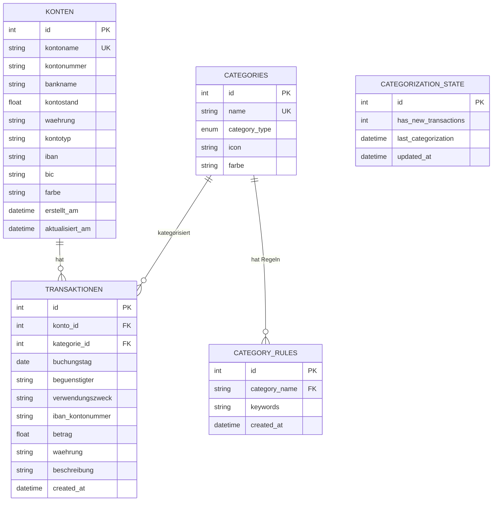

# FINLY - Dein Finanzmanager 📊

Willkommen bei **FINLY**, deiner einfachen und modernen Ausgabenverwaltung mit AI-Integration.

## 🚀 Schnellstart (Windows)

Das Projekt enthält ein automatisches Start-Skript für maximalen Komfort.

1.  **Doppelklicke auf `start.bat (Windows)/start.sh (Mac)` ** im Hauptordner.
2.  Das Skript prüft alles, startet den Server und öffnet deinen Browser automatisch.
3.  Fertig! 🎉

---

## 🛠️ Manuelle Installation (Alternative)

Falls du lieber die Kommandozeile nutzt oder Probleme mit dem Skript hast:

1.  **Voraussetzungen prüfen:**

    ```powershell
    python --version
    ```

2.  **Umgebung erstellen & aktivieren:**

    ```powershell
    python -m venv venv
    .\venv\Scripts\activate
    ```

    _(Achte auf das grüne `(venv)` am Zeilenanfang)_

3.  **Abhängigkeiten installieren:**

    ```powershell
    pip install -r requirements.txt
    ```

4.  **Konfiguration (.env):**
    Erstelle eine `.env` Datei mit deinem Google Gemini API Key (optional):

    ```env
    GEMINI_API_KEY=dein_key_hier
    ```

5.  **Starten:**
    ```powershell
    python -m uvicorn src.api.main:app --reload
    ```
    Browser öffnen auf: http://127.0.0.1:8000

---

## ✨ Features

- **Dashboard**: Einnahmen/Ausgaben Übersicht mit interaktiven Charts.
- **Auto-Kategorisierung**: AI lernt aus deinen Buchungen.
- **CSV Import**: Importiere Bankumsätze per Drag & Drop.
- **Finanz-Buddy (Chatbot)**: Stelle Fragen an deine Finanzen (benötigt API Key).
- **Zinsrechner**: Plane deine Sparziele.

## 📁 Projektstruktur

- **`start.bat`**: Ein-Klick-Startskript.
- **`src/`**: Backend (FastAPI, Datenbank).
- **`static/`**: Frontend (CSS, JS).
- **`templates/`**: HTML Seiten.
- **`data/`**: Hier liegt deine Datenbank (`expenses.db`).

### Categories-Modul

#### Zielsetzung und Funktionalität

Das Categories-Modul ermöglicht die automatische Zuordnung von Transaktionen zu Kategorien mittels regelbasierter Kategorisierung. Das System ist selbstlernend und verbessert sich durch Analyse bereits kategorisierter Transaktionen kontinuierlich.

#### 1.2 Komponenten und Aufbau

**Dateistruktur:**

```
src/categories/
├── __init__.py                    # Modul-Initialisierung und Exports
├── categories.py                  # Kategorieverwaltung und -operationen
├── categorizer_rules.py           # Regelbasierte Kategorisierungs-Engine
├── auto_categorizer_service.py    # Iterativer Kategorisierungs- und Lernservice
└── rules.py                       # Standard-Kategorisierungsregeln
```

**1. `categories.py`** - Kategorieverwaltung

- **Standard-Kategorien**: Automatisches Laden von vordefinierten Kategorien (Lebensmittel, Miete, Gehalt, etc.) bei erster Nutzung
- **CRUD-Operationen**:
  - `add_category()`: Erstellt neue Kategorien mit Validierung
  - `remove_category()`: Löscht Kategorien inklusive zugehöriger Regeln
  - `get_categories()`: Ruft alle verfügbaren Kategorien ab
  - `assign_category_to_transaction()`: Weist Transaktionen Kategorien zu
- **Sonstiges**:
  - Icon- und Farbunterstützung für UI-Integration
  - Konsistente Foreign-Key-Behandlung beim Löschen

**2. `categorizer_rules.py`** - Kategorisierungs-Engine

- **Hauptklasse `Categorizer`**: Regelbasierte Kategorisierung

- **Kernfunktionen**:
  - `suggest_category()`: Schlägt Kategorie basierend auf Keywords vor
  - `categorize_all()`: Kategorisiert alle oder nur unkategorisierte Transaktionen
  - `learn_from_categorized_transactions()`: Lernt neue Keywords aus bereits kategorisierten Daten
  - `add_keyword_to_rule()` / `remove_keyword_from_rule()`: Dynamische Regelverwaltung
- **Intelligente Features**:
  - Keyword-Matching über mehrere Transaktionsfelder (Begünstigter, Verwendungszweck, IBAN, Beschreibung)
  - Stopword-Filter zur Vermeidung von generischen Keywords
  - Eindeutigkeitsprüfung: Keywords werden nur gelernt, wenn sie eindeutig einer Kategorie zugeordnet sind
  - Caching-Mechanismus mit 5-Minuten-Zeitfenster für Performance-Optimierung

**3. `auto_categorizer_service.py`** - Automatisierter Lernservice

- **Hauptklasse `AutoCategorizerService`**: Orchestriert iterative Kategorisierungs- und Lernzyklen
- **Iterativer Lernzyklus** (`run_full_categorization_cycle()`):

1. Kategorisiert alle unkategorisierten Transaktionen
2. Zählt aktuelle Keywords
3. Lernt neue Keywords aus kategorisierten Transaktionen
4. Prüft ob neue Keywords hinzugefügt wurden
5. Wiederholt Prozess bis keine neuen Keywords mehr gefunden werden

- **Automatische Trigger**:
  - **Backend-Start**: Prüft beim Starten der Anwendung automatisch auf neue Transaktionen und führt bei Bedarf einen Lernzyklus aus
  - **CSV-Import**: Startet nach jedem erfolgreichen CSV-Import automatisch einen vollständigen Lernzyklus
  - **Transaktions-Schwellwert**: Löst automatisch einen Lernzyklus aus, sobald 5 neue Transaktionen hinzugefügt wurden (Wert ist konfigurierbar)
- **State-Management**:
  - `increment_transaction_counter()`: Zählt neue Transaktionen
  - `should_trigger_categorization()`: Prüft ob Auto-Kategorisierung ausgelöst werden soll (Schwellwert-basiert)
  - `get_categorization_state()`: Gibt aktuellen Status zurück
- **Singleton-Pattern**: Globale Service-Instanz über `get_auto_categorizer_service()`

**4. `rules.py`** - Regelkonfiguration

- Enthält `DEFAULT_CATEGORIZATION_RULES` mit vordefinierten Keywords für Standardkategorien
- Wird beim ersten Start automatisch in die Datenbank geladen

#### 1.3 Technische Details

**Datenbank-Integration:**

- Nutzt SQLAlchemy ORM mit `SessionLocal()`
- Tabellen: `Category`, `CategoryRules`, `Transaktion`, `CategorizationState`
- Automatische Migration und Initialisierung

**Algorithmus-Logik:**

1. **Keyword-Extraktion**: Transaktionsfelder werden zu einem Suchtext kombiniert und in Kleinbuchstaben konvertiert
2. **Pattern-Matching**: Jede Regel wird gegen den Suchtext geprüft
3. **Adaptive Regelgenerierung**: Häufig vorkommende, eindeutige Keywords werden automatisch als neue Regeln hinzugefügt
4. **Feedback-Loop**: System verbessert sich durch jede kategorisierte Transaktion

**Besondere Algorithmus-Features:**

- **Stopword-Filter**: Entfernt bedeutungslose Wörter wie "und", "für", "mit"
- **Mindestlänge**: Keywords müssen mindestens 3 Zeichen haben
- **Eindeutigkeitsprüfung**: Keywords, die in mehreren Kategorien vorkommen, werden ignoriert
- **Häufigkeitsfilter**: Nur Keywords mit Mindestanzahl an Vorkommen (default: 3) werden gelernt

---

### 2. Chatbot-Modul

#### 2.1 Zielsetzung und Funktionalität

Das Chatbot-Modul implementiert einen KI-gestützten Finanzassistenten, der natürlichsprachige Anfragen zu Finanzdaten beantwortet. Es nutzt Google Gemini API mit automatischem Function Calling, um präzise Datenbankabfragen durchzuführen und Analysen zu generieren.

#### 2.2 Komponenten und Aufbau

**Dateistruktur:**

```
src/chatbot/
├── __init__.py           # Modul-Exports
├── gemini_client.py      # Gemini API Client mit Function Calling
└── tools.py              # Database-Tools für Function Calling
```

**1. `gemini_client.py`** - Gemini API Integration

- **Hauptklasse `GeminiChatbot`**: Verwaltet Kommunikation mit Gemini API
- **Initialisierung**:
  - Benötigt API-Key und SQLAlchemy Session
  - Verwendet Modell `gemini-2.5-flash`
  - Hält Chat-Historie für Kontext
- **System Instruction**: Definiert Verhaltensregeln für den Assistenten:
  - Immer Tools verwenden, niemals raten
  - Kein manuelles Rechnen - nur Tool-basierte Berechnungen
  - Präzise Antworten ohne Erfindung von Daten
  - Unterstützung für komplexe Multi-Filter-Anfragen
- **Methoden**:
  - `send_message()`: Sendet Benutzeranfrage und erhält KI-Antwort mit automatischem Function Calling
  - `reset_chat()`: Löscht Chat-Historie

**2. `tools.py`** - Function Calling Tools

- **Session-Management**:
  - `set_db_session()`: Setzt globale Datenbank-Session
  - `get_db_session()`: Gibt aktuelle Session zurück
- **Implementierte Tools** (8 Funktionen):

**a) `get_transactions()`** - Transaktionsabfrage - Filter: Datumsbereich, Kategorie, Typ (Einnahme/Ausgabe) - Limit-Parameter (default: 100) - Sortierung nach Buchungstag (absteigend)

**b) `get_spending_by_category()`** - Ausgaben nach Kategorie - Aggregiert Ausgaben pro Kategorie - Optionaler Datumsfilter - Sortiert nach Gesamtausgaben

**c) `get_monthly_summary()`** - Monatliche Zusammenfassung - Einnahmen und Ausgaben pro Monat - Berechnet Bilanz (Einnahmen - Ausgaben) - Jahr-Parameter (default: aktuelles Jahr)

**d) `get_account_overview()`** - Kontoübersicht - Listet alle Konten mit Details - Kontostände, Kontotypen, Banknamen

**e) `get_income_vs_expenses()`** - Einnahmen vs. Ausgaben - Vergleich für definierten Zeitraum - Berechnet Gesamtbilanz

**f) `get_categories()`** - Kategorienliste - Gibt alle verfügbaren Kategorien zurück - Mit Typ (Einnahme/Ausgabe)

**g) `get_database_statistics()`** - Datenbank-Statistiken - Anzahl Transaktionen, Konten, Kategorien - Zeitraum der ersten bis letzten Transaktion - Datenbank-Status

**h) `get_transaction_stats()`** - Statistische Berechnungen - Berechnet: Summe, Anzahl, Durchschnitt, Min, Max - Alle Filter wie bei `get_transactions()` verfügbar - **Wichtig**: Soll für alle Summen-/Durchschnittsberechnungen verwendet werden

**3. `__init__.py`** - Modul-Exports

- Exportiert `GeminiChatbot` für einfachen Import

#### 2.3 Technische Details

**Function Calling Workflow:**

1. User stellt Frage
2. Gemini analysiert Anfrage und entscheidet welche Tools benötigt werden
3. API ruft automatisch relevante Tools auf
4. Tools führen Datenbankabfragen durch
5. Ergebnisse werden zurück an Gemini gegeben
6. Gemini generiert natürlichsprachige Antwort basierend auf Daten

**Automatisches Function Calling:**

- Gemini entscheidet selbstständig welche Funktionen aufgerufen werden
- Mehrere Function Calls pro Anfrage möglich
- Ergebnisse werden automatisch in Kontext integriert

**Fehlerbehandlung:**

- Try-Catch für API-Fehler
- Benutzerfreundliche Fehlermeldungen
- Robuste None-Checks bei Datenbankabfragen

---

### 3. API-Modul

#### 3.1 Zielsetzung und Funktionalität

Das API-Modul implementiert die RESTful-Schnittstelle der Anwendung basierend auf FastAPI. Es stellt alle HTTP-Endpunkte für Frontend-Interaktionen bereit, einschließlich CRUD-Operationen für Transaktionen, Konten und Kategorien sowie spezielle Features wie CSV-Import und Zinsrechner.

#### 3.2 Komponenten und Aufbau

**Dateistruktur:**

```
src/api/
├── __init__.py                    # Modul-Exports
├── main.py                        # FastAPI App-Bootstrap & Router-Registrierung
├── dependencies.py                # Dependency Injection (DB-Sessions)
├── helpers.py                     # Hilfsfunktionen
├── schemas.py                     # Pydantic-Schemas für Request/Response Validierung
├── transactions_routes.py         # Transaktions- und Konto-Endpunkte
├── category_routes.py             # Kategorie-Endpunkte
├── auto_categorization_routes.py  # Auto-Kategorisierungs-Endpunkte
├── chatbot_routes.py              # Chatbot-Endpunkte
├── zinsrechner_routes.py          # Zinsrechner-Endpunkte
└── settings_routes.py             # Einstellungs-Endpunkte
```

**1. `main.py`** - App-Bootstrap

- **FastAPI-Initialisierung**: Erstellt die Hauptanwendung mit Titel, Beschreibung und Version
- **Lifespan-Pattern**: Modernes Startup/Shutdown-Management
  - Initialisiert Datenbank beim Start
  - Führt Auto-Kategorisierung bei Bedarf aus
- **Middleware**: CORS-Konfiguration für Cross-Origin-Requests
- **Static Files**: Mounting von `/static` und `/templates` Verzeichnissen
- **Router-Registrierung**: Bindet alle Sub-Router (transactions, categories, chatbot, etc.)
- **Seiten-Routen**: Liefert HTML-Seiten für Dashboard, Transaktionen, Kategorien, Konten, Zinsrechner und Finanz-Buddy

**2. `schemas.py`** - Pydantic-Schemas

- **Transaktion-Schemas**:
  - `TransaktionBase`: Basis-Schema mit allen Feldern
  - `TransaktionCreate`: Für neue Transaktionen
  - `TransaktionUpdate`: Für Aktualisierungen (alle Felder optional)
  - `TransaktionResponse`: Für API-Responses (inkl. ID und Timestamp)
  - `TransaktionSearch`: Für erweiterte Suchfilter
- **Konto-Schemas**:
  - `KontoBase`, `KontoCreate`, `KontoUpdate`, `KontoResponse`
  - Computed Field `iban_kurz` für gekürzte IBAN-Darstellung
- **Chatbot-Schemas**: Request/Response-Schemas für Chat-Interaktionen
- **Category-Schemas**: Schemas für Kategorieverwaltung

**3. `transactions_routes.py`** - Hauptrouter

- **Transaktions-Endpunkte**:
  - `GET /transactions`: Alle Transaktionen (mit Datumsfilter)
  - `GET /transactions/formatted`: Formatierte Daten für Frontend
  - `GET /transactions/{id}`: Einzelne Transaktion
  - `POST /transactions`: Neue Transaktion erstellen
  - `PUT /transactions/{id}`: Transaktion aktualisieren
  - `DELETE /transactions/{id}`: Transaktion löschen
- **Konto-Endpunkte**:
  - CRUD-Operationen für Konten
  - `GET /konten/{id}/saldo`: Kontostand berechnen
  - `GET /konten/summary`: Konto-Zusammenfassung
- **Spezial-Endpunkte**:
  - `GET /transactions/sankey-data`: Daten für Sankey-Diagramm
  - `POST /search/transactions`: Erweiterte Suche
  - `POST /import/transactions`: CSV-Import

**4. `dependencies.py`** - Dependency Injection

- `get_db()`: Generator für Datenbank-Sessions
- Automatisches Session-Management (Öffnen/Schließen)

#### 3.3 Technische Details

**Request/Response-Flow:**

1. HTTP-Request trifft auf FastAPI-Endpunkt
2. Pydantic-Schema validiert Request-Daten
3. Dependency Injection stellt DB-Session bereit
4. Route-Handler führt Geschäftslogik aus
5. Response wird durch Pydantic-Schema validiert und serialisiert

**Besondere Features:**

- **Automatische Dokumentation**: OpenAPI/Swagger UI unter `/docs`
- **Datenvalidierung**: Pydantic-Schemas mit Field-Constraints
- **Error Handling**: HTTPException für standardisierte Fehlercodes
- **CORS**: Vollständig konfiguriert für Frontend-Zugriff

---

### 4. Datenbank-Modul

#### 4.1 Zielsetzung und Funktionalität

Das Datenbank-Modul verwaltet die Datenpersistenz der Anwendung. Es nutzt SQLAlchemy als ORM und SQLite als Datenbank-Engine. Das Modul definiert alle Datenmodelle, stellt Verbindungsmanagement bereit und bietet spezialisierte Services für CSV-Import, Kontooperationen und Transaktionssuche.

#### 4.2 Komponenten und Aufbau

**Dateistruktur:**

```
src/database/
├── __init__.py           # Modul-Exports und zentrale Imports
├── connection.py         # Datenbankverbindung und Session-Factory
├── models.py             # SQLAlchemy ORM-Modelle
├── konto_manager.py      # Konto-Verwaltungsoperationen
├── csv_importer.py       # CSV-Import-Funktionalität
└── search.py             # Erweiterte Transaktionssuche
```

**Datenbankdiagramm:**



**1. `models.py`** - Datenmodelle

- **`Konto`**: Bankkonto-Modell
  - Felder: id, kontoname, kontonummer, bankname, kontostand, waehrung, kontotyp, iban, bic, farbe
  - Timestamps: erstellt_am, aktualisiert_am
  - Relationship: transaktionen (1:n)
- **`Transaktion`**: Transaktions-Modell
  - Felder: id, konto_id, buchungstag, beguenstigter, verwendungszweck, iban_kontonummer, betrag, waehrung, beschreibung, kategorie_id
  - Relationships: konto, kategorie
- **`Category`**: Kategorie-Modell
  - Felder: id, name, category_type (Enum: Ausgabe/Einnahme), icon, farbe
  - Relationship: transaktionen
- **`CategoryRules`**: Kategorisierungsregeln
  - Felder: id, category_name, keywords, created_at
  - Relationship: category
- **`CategorizationState`**: Singleton für Kategorisierungs-Status
  - Felder: has_new_transactions, last_categorization, updated_at

**2. `connection.py`** - Verbindungsmanagement

- **Datenbankpfad**: `data/expenses.db` (relativ zum Projekt-Root)
- **Engine**: SQLite mit SQLAlchemy
- **SessionLocal**: Session-Factory für Datenbank-Operationen
- **Funktionen**:
  - `init_db()`: Initialisiert Datenbank und lädt Standard-Kategorien
  - `ensure_categorization_state()`: Stellt Singleton-Eintrag sicher

**3. `konto_manager.py`** - Konto-Manager

- **Klasse `KontoManager`**: Statische Methoden für Kontooperationen
- **CRUD-Operationen**:
  - `erstelle_konto()`: Neues Konto anlegen
  - `hole_konto()` / `hole_konto_by_iban()`: Konto abrufen
  - `hole_alle_konten()`: Alle Konten laden
  - `aktualisiere_kontoinformationen()`: Konto-Daten ändern
  - `lösche_konto()`: Konto mit Transaktionen löschen
- **Kontostand-Operationen**:
  - `aktualisiere_kontostand()`: Direktes Setzen
  - `erhöhe_kontostand()`: Betrag addieren/subtrahieren
  - `berechne_kontostand_aus_transaktionen()`: Aus Transaktionen berechnen
  - `aktualisiere_kontostand_aus_transaktionen()`: Automatische Neuberechnung

**4. `csv_importer.py`** - CSV-Import

- **Klasse `CSVTransaktionImporter`**: Importiert Bankumsätze aus CSV-Dateien
- **Konfiguration**:
  - session: SQLAlchemy-Session
  - mapping: Feld-Mapping (Model-Felder → CSV-Spalten)
  - header_row: Zeile der Spaltenüberschriften
  - skip_footer: Fußzeilen überspringen
  - konto_id: Ziel-Konto für Import
- **Methoden**:
  - `detect_delimiter()`: Automatische Delimiter-Erkennung (`;`, `,`, `\t`, `|`)
  - `parse_date()`: Datum-Parsing (Format: dd.mm.yyyy)
  - `parse_float()`: Europäisches Zahlenformat (1.234,56)
  - `import_csv()`: Hauptimport-Methode

**5. `search.py`** - Transaktionssuche

- **Funktion `search_transaktionen()`**: Flexible Filtersuche
- **Unterstützte Filter**:
  - buchungstag: Exaktes Datum
  - beguenstigter/verwendungszweck: Teiltext-Suche (case-insensitive)
  - iban_kontonummer: IBAN-Suche (Leerzeichen ignoriert)
  - betrag_min/betrag_max: Betragsbereich
  - betrag_min_abs/betrag_max_abs: Absolutbetrags-Filter
  - typ: "expense" oder "income"
  - waehrung, konto_name, beschreibung, kategorie_name
- **Features**:
  - OuterJoin für Transaktionen ohne Konto/Kategorie
  - Validierung: betrag_min ≤ betrag_max
  - Sortierung nach Buchungstag (absteigend)

